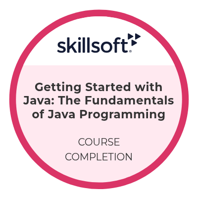

# Professional Certifications

This repository contains my professional certifications earned through online learning platforms and technical training programs. These certifications demonstrate continuous learning and skill development across programming, web development, databases, and software engineering fundamentals.

## Certifications

### Programming using Java - Special Batches

* Platform: Infosys Springboard
* Course Provider: Skillsoft
* Year: 2026
* Skills Learned:

  * Java Programming Fundamentals
  * Variables, Identifiers, Keywords, and Data Types
  * Operators and Type Conversion
  * Selection and Iteration Control Structures
  * Object-Oriented Programming
  * Methods and Constructors
  * Encapsulation and Abstraction
  * Access Modifiers
  * Arrays and Strings
  * Memory Management
  * Debugging and Code Analysis
  * Static Members
  * Association and Aggregation
  * Inheritance
  * Method Overloading and Method Overriding
  * Object and Wrapper Classes
  * Abstract Classes
  * Interfaces and Packages
  * Exception Handling
  * Unit Testing and Code Coverage
  * Regular Expressions
  * Collections Framework and Generics
  * ArrayList and LinkedList
  * Set Interface
  * HashMap
  * Queue Interface

### Programming for Everybody (Getting Started with Python)

* Platform: Coursera
* Organization: University of Michigan
* Year: 2023
* Skills Learned:

  * Python Basics
  * Variables and Data Types
  * Conditional Statements
  * Loops
  * Functions

### Introduction to Java

* Platform: Coursera
* Organization: LearnQuest
* Year: 2023
* Skills Learned:

  * Java Fundamentals
  * Object-Oriented Programming
  * Methods and Classes
  * Exception Handling Basics

### JavaScript Basics

* Platform: Coursera
* Organization: University of California, Davis
* Year: 2022
* Skills Learned:

  * JavaScript Fundamentals
  * Variables
  * Functions
  * DOM Concepts

### SQL and Relational Databases 101

* Platform: IBM Cognitive Class
* Year: 2023
* Skills Learned:

  * SQL Queries
  * Database Design
  * Relational Databases
  * Data Manipulation

### Front End Development - HTML

* Platform: Great Learning
* Year: 2024
* Skills Learned:

  * HTML5
  * Forms
  * Tables
  * Semantic Elements

### Front End Development - CSS

* Platform: Great Learning
* Year: 2024
* Skills Learned:

  * CSS Styling
  * Flexbox
  * Responsive Design
  * Layout Techniques

## Digital Badges

### Getting Started with Java: The Fundamentals of Java Programming

  

* Learning Platform: Infosys Springboard
* Badge Provider: Skillsoft
* Year: 2026
* Achievement: Course Completion
* Focus Area: Java Programming Fundamentals

## Technical Skills

* Java
* Python
* SQL
* HTML5
* CSS3
* JavaScript
* Object-Oriented Programming
* Java Collections Framework
* Exception Handling
* Unit Testing
* Git
* GitHub

## Learning Goal

To continuously strengthen my technical knowledge and build expertise in Java Full Stack Development through structured learning, professional certifications, practical programming, and project development.

## Repository Contents

* `Programming_using_Java_Infosys_Springboard.pdf`
* `Introduction_to_Java_Coursera.pdf`
* `Programming_for_Everybody_Python_Coursera.pdf`
* `JavaScript_Basics_Coursera.pdf`
* `SQL_and_Relational_Databases_IBM.pdf`
* `Front_End_Development_HTML_GreatLearning.pdf`
* `Front_End_Development_CSS_GreatLearning.pdf`
* `Badges/Getting_Started_with_Java_Skillsoft_Badge.png`

## Author

**Shaik Mahaboob Basha**

Java Full Stack Developer
