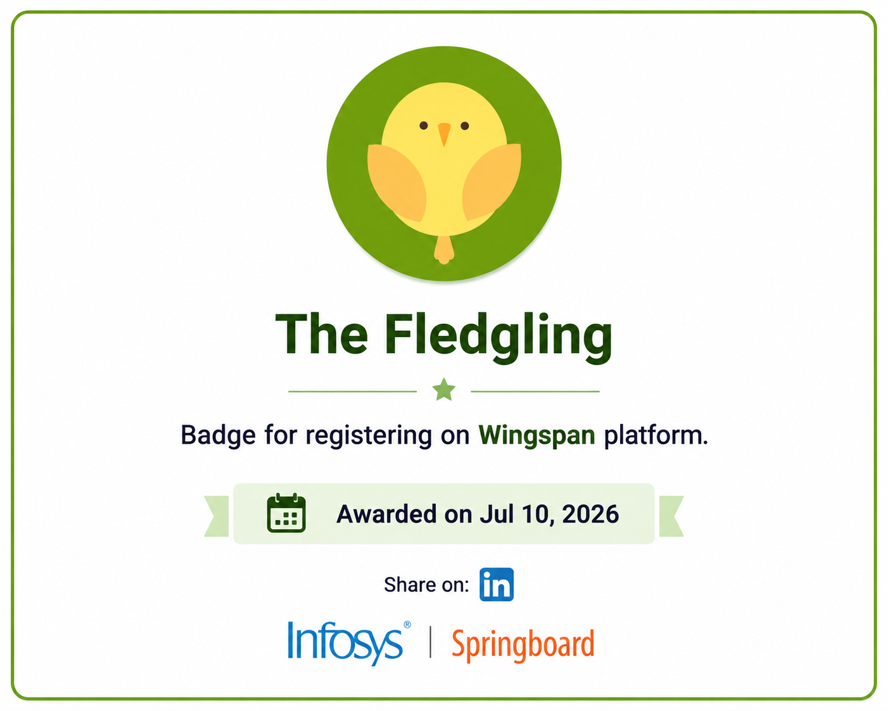
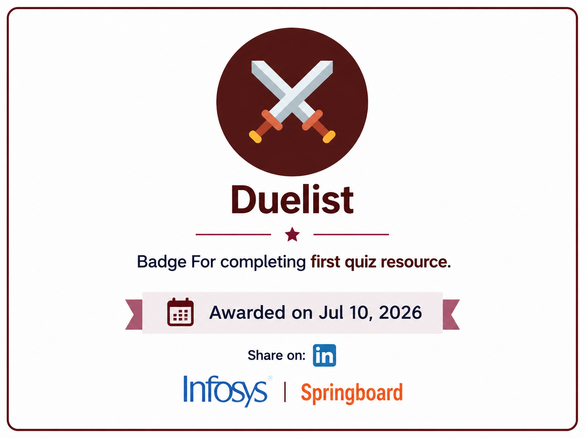
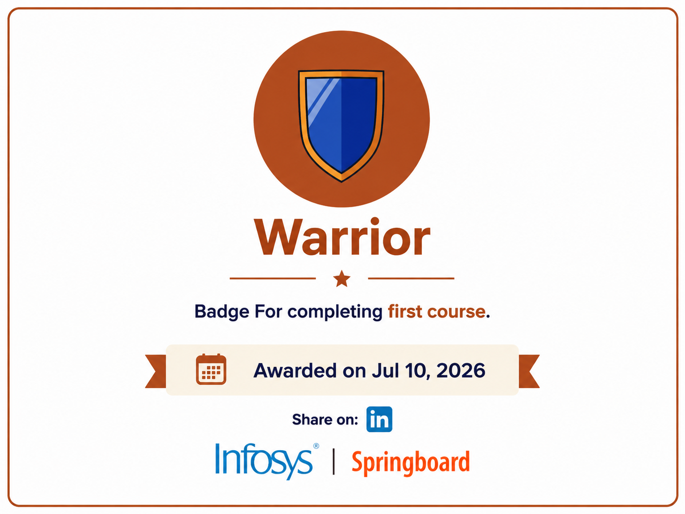
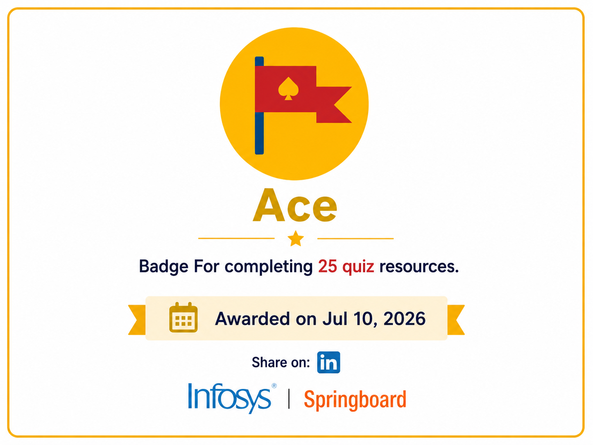
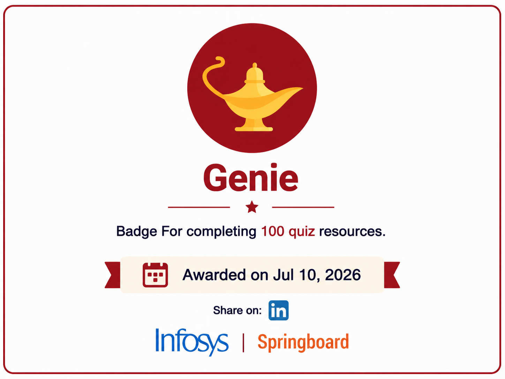
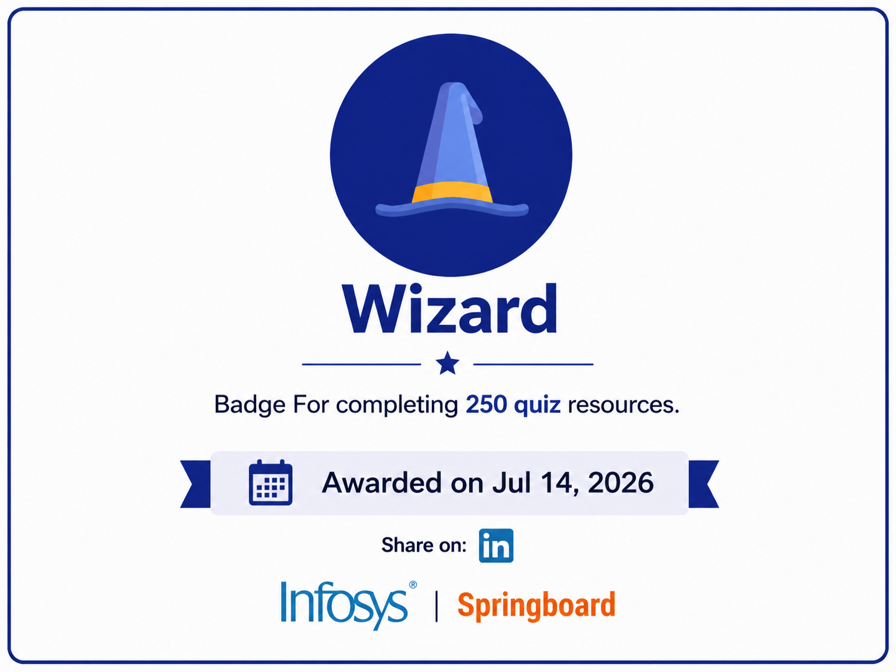

<div align="center">

# 🏆 Professional Certifications

### A Curated Collection of Professional Certifications, Digital Achievement Badges, and Continuous Learning Milestones


### Professional Learning Portfolio

*A comprehensive collection of verified professional certifications, digital achievement badges, and structured technical learning milestones earned through globally recognized learning platforms.*

[](https://github.com/shaikbasha-dev)
[](https://www.linkedin.com/in/shaikbasha-dev/)

</div>

---

# 📖 Repository Overview

Welcome to the **Professional Certifications** repository.

This repository serves as a centralized portfolio of professional certifications, digital achievement badges, and technical learning accomplishments earned through continuous learning and structured technical education.

The certifications and badges included in this repository demonstrate knowledge and practical learning across multiple technology domains, including:

- Java Programming
- Oracle SQL
- HTML5
- CSS3
- JavaScript
- Python
- Database Management Systems
- Web Development
- Object-Oriented Programming
- Java Full Stack Development

Each certificate validates successful completion of professional learning programs from recognized educational platforms, while the digital badges showcase consistent participation, assessment achievements, and progressive technical learning milestones.

---

# 🎯 Repository Objectives

This repository has been created to:

- Showcase verified professional certifications.
- Maintain a structured technical learning portfolio.
- Demonstrate continuous learning and professional development.
- Highlight programming, database, and web development skills.
- Build a recruiter-friendly GitHub portfolio.
- Track progress toward becoming a Java Full Stack Developer.

---

# 📊 Repository Statistics

| Category | Details |
|-----------|---------|
| 🎓 Professional Certificates | **11** |
| 🏅 Digital Achievement Badges | **7** |
| 🌐 Learning Platforms | **4** |
| 💻 Programming Languages | **Java, Python, JavaScript, SQL** |
| 🎨 Frontend Technologies | **HTML5, CSS3** |
| 🗄️ Database Technologies | **Oracle SQL** |
| 🎯 Career Focus | **Java Full Stack Development** |

---

# 🌐 Learning Platforms

The certifications contained in this repository have been earned through the following professional learning platforms.

| Platform | Description |
|----------|-------------|
| **Infosys Springboard** | Industry-oriented learning platform offering professional technical courses and certifications. |
| **Coursera** | Global online learning platform providing university-recognized courses. |
| **IBM Cognitive Class** | Learning platform focused on databases, cloud computing, artificial intelligence, and software development. |
| **Great Learning** | Professional learning platform offering practical software development and web development courses. |

---

# 🎓 Professional Certifications

The following certifications demonstrate continuous learning across programming languages, databases, web technologies, and software engineering concepts.

---

## 1️⃣ Programming using Java – Special Batches

| Property | Details |
|----------|---------|
| **Platform** | Infosys Springboard |
| **Course Provider** | Skillsoft |
| **Year** | 2026 |

### Skills Acquired

- Java Programming Fundamentals
- Variables, Identifiers, and Keywords
- Primitive Data Types
- Operators and Expressions
- Type Conversion
- Control Statements
- Looping Statements
- Methods and Constructors
- Object-Oriented Programming
- Encapsulation
- Abstraction
- Access Modifiers
- Arrays and Strings
- Memory Management
- Static Members
- Association and Aggregation
- Inheritance
- Method Overloading
- Method Overriding
- Wrapper Classes
- Abstract Classes
- Interfaces
- Packages
- Exception Handling
- Unit Testing
- Regular Expressions
- Java Collections Framework
- Generics
- ArrayList
- LinkedList
- Set Interface
- HashMap
- Queue Interface

---

## 2️⃣ Getting Started with Java: The Fundamentals of Java Programming

| Property | Details |
|----------|---------|
| **Platform** | Infosys Springboard |
| **Year** | 2026 |
| **Completion Date** | July 11, 2026 |
| **Certificate Issued** | July 12, 2026 |

### Skills Acquired

- Java Programming Fundamentals
- Java Syntax
- Program Structure
- Variables and Data Types
- Operators and Expressions
- Control Flow
- Object-Oriented Programming Fundamentals
- Classes and Objects
- Methods
- Java Development Fundamentals

---

## 3️⃣ HTML5 – The Language

| Property | Details |
|----------|---------|
| **Platform** | Infosys Springboard |
| **Year** | 2026 |
| **Completion Date** | July 14, 2026 |

### Skills Acquired

- HTML5 Fundamentals
- HTML Document Structure
- HTML Elements and Attributes
- Forms and Validation
- Semantic HTML
- Tables and Lists
- Images and Multimedia
- IFrames
- Accessibility
- Web Security Fundamentals

---

## 4️⃣ CSS3

| Property | Details |
|----------|---------|
| **Platform** | Infosys Springboard |
| **Year** | 2026 |
| **Completion Date** | July 14, 2026 |
| **Certificate Issued** | July 15, 2026 |

### Skills Acquired

- CSS Fundamentals
- Selectors
- Colors and Backgrounds
- Typography
- CSS Box Model
- Margin, Border, and Padding
- Positioning
- Flexbox
- CSS Grid
- Responsive Web Design
- Media Queries
- Pseudo-Classes and Pseudo-Elements
- CSS Transitions
- CSS Transformations
- CSS Animations

---

## 5️⃣ Introduction to Oracle: SQL

| Property | Details |
|----------|---------|
| **Platform** | Infosys Springboard |
| **Year** | 2026 |
| **Completion Date** | July 23, 2026 |
| **Certificate Issued** | July 24, 2026 |

### Skills Acquired

- Database Management Systems (DBMS)
- Entity Relationship (ER) Model
- Database Normalization
- Structured Query Language (SQL)
- Restricting and Sorting Data
- Single Row Functions
- Multiple Row Functions
- SQL Joins
- Subqueries
- Data Manipulation Language (DML)
- Data Definition Language (DDL)
- Oracle Date and Time Functions
- Pseudocolumns
- Constraints
- Sequences
- Views
- Indexes
- Controlling User Access
- Synonyms
- Oracle SQL Best Practices

---

## 6️⃣ Programming for Everybody (Getting Started with Python)

| Property | Details |
|----------|---------|
| **Platform** | Coursera |
| **Organization** | University of Michigan |
| **Year** | 2023 |

### Skills Acquired

- Python Fundamentals
- Variables and Data Types
- Conditional Statements
- Loops
- Functions
- Problem Solving
- Basic Python Programming

---

## 7️⃣ Introduction to Java

| Property | Details |
|----------|---------|
| **Platform** | Coursera |
| **Organization** | LearnQuest |
| **Year** | 2023 |

### Skills Acquired

- Java Fundamentals
- Classes and Objects
- Object-Oriented Programming
- Methods
- Constructors
- Exception Handling Basics

---

## 8️⃣ JavaScript Basics

| Property | Details |
|----------|---------|
| **Platform** | Coursera |
| **Organization** | University of California, Davis |
| **Year** | 2022 |

### Skills Acquired

- JavaScript Fundamentals
- Variables
- Data Types
- Operators
- Functions
- DOM Manipulation
- Event Handling

---

## 9️⃣ SQL and Relational Databases 101

| Property | Details |
|----------|---------|
| **Platform** | IBM Cognitive Class |
| **Year** | 2023 |

### Skills Acquired

- SQL Fundamentals
- Relational Databases
- SQL Queries
- Database Design
- Data Retrieval
- Data Manipulation

---

## 🔟 Front End Development – HTML

| Property | Details |
|----------|---------|
| **Platform** | Great Learning |
| **Year** | 2024 |

### Skills Acquired

- HTML5 Fundamentals
- HTML Document Structure
- Semantic HTML
- Tables
- Forms
- Hyperlinks
- Images

---

## 1️⃣1️⃣ Front End Development – CSS

| Property | Details |
|----------|---------|
| **Platform** | Great Learning |
| **Year** | 2024 |

### Skills Acquired

- CSS Fundamentals
- CSS Selectors
- Styling Web Pages
- Colors and Fonts
- Flexbox
- Responsive Design
- Layout Techniques

---

# 📋 Certification Summary

| No. | Certification | Platform | Year | Domain |
|:--:|---------------|----------|:---:|--------|
| 1 | Programming using Java – Special Batches | Infosys Springboard | 2026 | Java |
| 2 | Getting Started with Java: The Fundamentals of Java Programming | Infosys Springboard | 2026 | Java |
| 3 | HTML5 – The Language | Infosys Springboard | 2026 | HTML5 |
| 4 | CSS3 | Infosys Springboard | 2026 | CSS3 |
| 5 | Introduction to Oracle: SQL | Infosys Springboard | 2026 | Oracle SQL |
| 6 | Programming for Everybody (Getting Started with Python) | Coursera | 2023 | Python |
| 7 | Introduction to Java | Coursera | 2023 | Java |
| 8 | JavaScript Basics | Coursera | 2022 | JavaScript |
| 9 | SQL and Relational Databases 101 | IBM Cognitive Class | 2023 | SQL |
| 10 | Front End Development – HTML | Great Learning | 2024 | HTML5 |
| 11 | Front End Development – CSS | Great Learning | 2024 | CSS3 |

---

# 🏅 Digital Achievement Badges

In addition to professional certifications, this repository includes digital achievement badges earned through **Infosys Springboard**.

These badges recognize important milestones achieved throughout my learning journey, including platform participation, course completion, quiz completion, and continuous technical skill development.

The badge collection reflects consistent learning, regular assessments, and progressive growth while building expertise in software development and Java Full Stack technologies.

---

## 🥇 Getting Started with Java: The Fundamentals of Java Programming

<div align="center">


</div>

| Property | Details |
|----------|---------|
| **Learning Platform** | Infosys Springboard |
| **Badge Provider** | Skillsoft |
| **Year** | 2026 |
| **Achievement** | Successfully Completed the Course |
| **Focus Area** | Java Programming Fundamentals |

### Badge Overview

This badge recognizes the successful completion of the **Getting Started with Java: The Fundamentals of Java Programming** course. It demonstrates a solid understanding of Java fundamentals, object-oriented programming concepts, and structured software development practices.

---

## 🐣 The Fledgling

<div align="center">



</div>

| Property | Details |
|----------|---------|
| **Learning Platform** | Infosys Springboard |
| **Year** | 2026 |
| **Awarded On** | July 10, 2026 |
| **Achievement** | Registered on the Wingspan Learning Platform |
| **Category** | Learning Platform Achievement |

### Badge Overview

The **Fledgling** badge marks the beginning of my learning journey on the Infosys Springboard platform. It represents the first milestone toward continuous learning and professional development.

---

## ⚔️ Duelist

<div align="center">



</div>

| Property | Details |
|----------|---------|
| **Learning Platform** | Infosys Springboard |
| **Year** | 2026 |
| **Awarded On** | July 10, 2026 |
| **Achievement** | Completed the First Quiz Resource |
| **Category** | Quiz Achievement |

### Badge Overview

The **Duelist** badge recognizes successful completion of the first quiz resource, demonstrating active participation in structured assessments and technical learning.

---

## 🛡️ Warrior

<div align="center">



</div>

| Property | Details |
|----------|---------|
| **Learning Platform** | Infosys Springboard |
| **Year** | 2026 |
| **Awarded On** | July 10, 2026 |
| **Achievement** | Successfully Completed the First Course |
| **Category** | Course Completion Achievement |

### Badge Overview

The **Warrior** badge celebrates the successful completion of the first professional course on Infosys Springboard and reflects commitment to continuous technical learning.

---

## 🏆 Ace

<div align="center">



</div>

| Property | Details |
|----------|---------|
| **Learning Platform** | Infosys Springboard |
| **Year** | 2026 |
| **Awarded On** | July 10, 2026 |
| **Achievement** | Completed 25 Quiz Resources |
| **Category** | Quiz Learning Achievement |

### Badge Overview

The **Ace** badge recognizes consistent participation in learning by successfully completing **25 quiz resources**, demonstrating dedication to technical assessment and skill development.

---

## 🧞 Genie

<div align="center">



</div>

| Property | Details |
|----------|---------|
| **Learning Platform** | Infosys Springboard |
| **Year** | 2026 |
| **Awarded On** | July 10, 2026 |
| **Achievement** | Completed 100 Quiz Resources |
| **Category** | Quiz Learning Achievement |

### Badge Overview

The **Genie** badge represents sustained dedication to learning through the successful completion of **100 quiz resources**, reflecting consistency, discipline, and continuous technical growth.

---

## 🧙 Wizard

<div align="center">



</div>

| Property | Details |
|----------|---------|
| **Learning Platform** | Infosys Springboard |
| **Year** | 2026 |
| **Awarded On** | July 14, 2026 |
| **Achievement** | Completed 250 Quiz Resources |
| **Category** | Advanced Quiz Learning Achievement |

### Badge Overview

The **Wizard** badge marks a significant learning milestone achieved after successfully completing **250 quiz resources**. It reflects continuous participation in assessments and a strong commitment to professional learning.

---

# 📈 Achievement Progression

The following badges represent my learning journey on the Infosys Springboard platform.

| Badge | Achievement | Milestone |
|--------|-------------|-----------|
| 🐣 **The Fledgling** | Registered on the Platform | Learning Journey Started |
| ⚔️ **Duelist** | Completed First Quiz | Assessment Journey Began |
| 🛡️ **Warrior** | Completed First Course | First Professional Milestone |
| 🏆 **Ace** | Completed 25 Quiz Resources | Consistent Learning |
| 🧞 **Genie** | Completed 100 Quiz Resources | Advanced Learning |
| 🧙 **Wizard** | Completed 250 Quiz Resources | Major Achievement Milestone |

---

# 📂 Badge Directory

```text
Badges/
│
├── README.md
├── Getting_Started_with_Java_Skillsoft_Badge.png
├── The_Fledgling_Infosys_Springboard_Badge.png
├── Duelist_First_Quiz_Resource_Infosys_Springboard_Badge.png
├── Warrior_First_Course_Infosys_Springboard_Badge.png
├── Ace_25_Quiz_Resources_Infosys_Springboard_Badge.png
├── Genie_100_Quiz_Resources_Infosys_Springboard_Badge.png
└── Wizard_250_Quiz_Resources_Infosys_Springboard_Badge.png
```

The **Badges** directory contains all digital achievement badges earned through Infosys Springboard. These badges highlight continuous learning, technical assessments, and professional development milestones achieved throughout my learning journey.

---

# 💻 Technical Skills

The certifications and digital achievement badges in this repository demonstrate knowledge and practical learning across multiple technologies, programming languages, databases, and software engineering concepts.

## Programming Languages

- Java
- Python
- JavaScript
- SQL

---

## Frontend Technologies

- HTML5
- CSS3
- Responsive Web Design
- Semantic HTML
- CSS Flexbox
- CSS Grid
- CSS Animations

---

## Database Technologies

- Oracle SQL
- Relational Database Management System (RDBMS)
- Database Design
- Entity Relationship (ER) Model
- Database Normalization
- SQL Joins
- Subqueries
- Views
- Indexes
- Constraints
- Sequences

---

## Java Technologies

- Core Java
- Object-Oriented Programming (OOP)
- Exception Handling
- Java Collections Framework
- Generics
- Wrapper Classes
- Interfaces
- Packages
- Arrays
- Strings
- Regular Expressions
- Unit Testing

---

## Software Development Skills

- Problem Solving
- Logical Thinking
- Programming Fundamentals
- Database Design
- Web Development
- Technical Documentation
- Continuous Learning

---

# 🎯 Learning Goal

This repository documents my continuous learning journey through professional certifications, technical courses, and digital achievement badges.

Each certification represents a step toward strengthening my technical foundation in software development while continuously improving my knowledge across Java, databases, web technologies, and related software engineering domains.

---

# 📂 Repository Structure

```text
Professional-Certifications/
│
├── Badges/
│   ├── README.md
│   ├── Getting_Started_with_Java_Skillsoft_Badge.png
│   ├── The_Fledgling_Infosys_Springboard_Badge.png
│   ├── Duelist_First_Quiz_Resource_Infosys_Springboard_Badge.png
│   ├── Warrior_First_Course_Infosys_Springboard_Badge.png
│   ├── Ace_25_Quiz_Resources_Infosys_Springboard_Badge.png
│   ├── Genie_100_Quiz_Resources_Infosys_Springboard_Badge.png
│   └── Wizard_250_Quiz_Resources_Infosys_Springboard_Badge.png
│
├── CSS3-Infosys-Springboard-Certificate-2026.pdf
├── Front_End_Development_CSS_GreatLearning.pdf
├── Front_End_Development_HTML_GreatLearning.pdf
├── Getting-Started-with-Java-Fundamentals-of-Java-Programming-Infosys-Springboard-2026.pdf
├── HTML5-The-Language-Infosys-Springboard-2026.pdf
├── Introduction-to-Oracle-SQL-Infosys-Springboard-2026.pdf
├── Introduction_to_Java_Coursera.pdf
├── JavaScript_Basics_Coursera.pdf
├── Programming_for_Everybody_Python_Coursera.pdf
├── Programming_using_Java_Infosys_Springboard.pdf
├── SQL_and_Relational_Databases_IBM.pdf
└── README.md
```

---

# 📦 Repository Contents

This repository currently contains:

- 📜 Professional Certificates
- 🏅 Digital Achievement Badges
- ☕ Java Certifications
- 🗄️ Oracle SQL Certifications
- 🌐 Frontend Development Certifications
- 🐍 Python Certifications
- 💻 Software Development Certifications
- 📈 Professional Learning Milestones

---

# 🚀 Future Learning Roadmap

This repository will continue to grow as I complete additional certifications and professional learning programs.

Planned learning areas include:

- Spring Framework
- Spring Boot
- Hibernate
- JDBC
- Angular
- TypeScript
- Manual Testing
- REST APIs
- Git & GitHub
- Docker
- Kubernetes
- AWS Cloud
- DevOps
- Microservices
- System Design

---

# 👨‍💻 Author

<div align="center">

## Shaik Mahaboob Basha

### Java Full Stack Developer

[](https://github.com/shaikbasha-dev)

[](https://www.linkedin.com/in/shaikbasha-dev/)

</div>

---

# 📝 Conclusion

This repository showcases my commitment to continuous learning, professional development, and lifelong technical growth.

Every certificate and digital achievement badge included here represents dedicated effort, successful completion of structured learning programs, and continuous improvement in software development skills.

As I continue expanding my knowledge and expertise in Java Full Stack Development, this repository will be updated with new certifications, achievements, and learning milestones.

---

<div align="center">

## Thank You for Visiting

Thank you for taking the time to explore my professional certifications and learning achievements.

</div>
